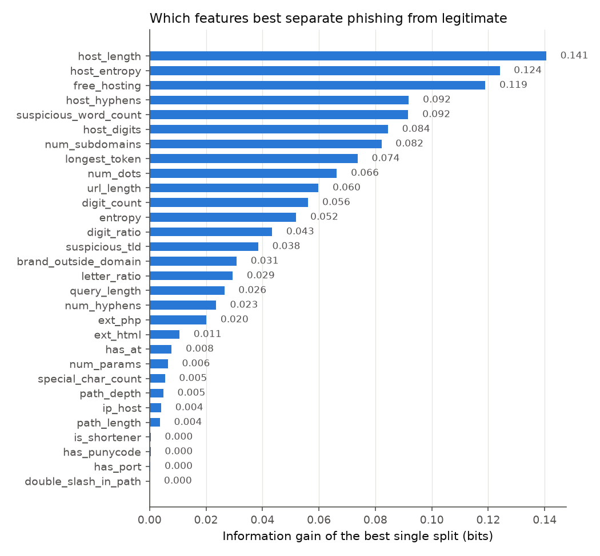
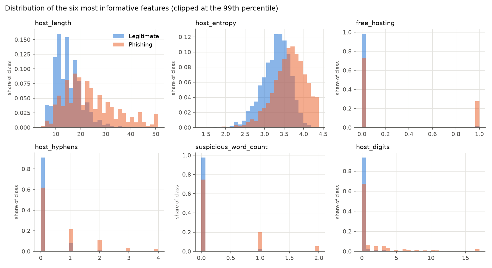
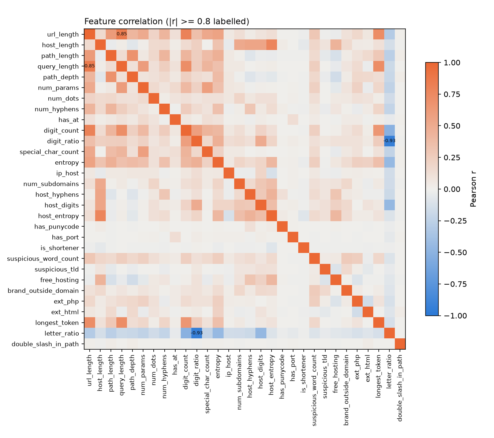
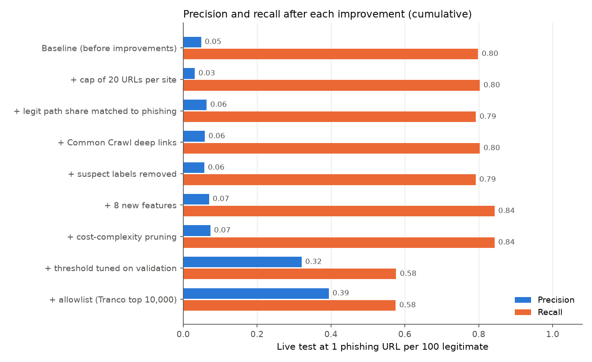

# Feature analysis

This report analyses the training set used by the final model, after all the improvements in the experiments section below.

97,844 training URLs, 48,922 phishing and 48,922 legitimate.

## Gini gain and information gain of the best single split

Each value is how much one threshold on that feature alone reduces impurity at the root of a tree. Higher means the feature separates the classes better on its own.

| feature | info_gain | gini_gain | best_threshold |
|---|---|---|---|
| host_length | 0.1406 | 0.0919 | 21.5000 |
| host_entropy | 0.1241 | 0.0809 | 3.6902 |
| free_hosting | 0.1190 | 0.0691 | 0.5000 |
| host_hyphens | 0.0918 | 0.0600 | 0.5000 |
| suspicious_word_count | 0.0917 | 0.0554 | 0.5000 |
| host_digits | 0.0845 | 0.0544 | 0.5000 |
| num_subdomains | 0.0821 | 0.0539 | 0.5000 |
| longest_token | 0.0737 | 0.0451 | 22.5000 |
| num_dots | 0.0664 | 0.0451 | 1.5000 |
| url_length | 0.0599 | 0.0390 | 16.5000 |
| digit_count | 0.0562 | 0.0356 | 10.5000 |
| entropy | 0.0520 | 0.0342 | 3.5218 |
| digit_ratio | 0.0434 | 0.0292 | 0.0003 |
| suspicious_tld | 0.0385 | 0.0239 | 0.5000 |
| brand_outside_domain | 0.0308 | 0.0187 | 0.5000 |
| letter_ratio | 0.0295 | 0.0195 | 0.6565 |
| query_length | 0.0265 | 0.0165 | 39.5000 |
| num_hyphens | 0.0235 | 0.0162 | 0.5000 |
| ext_php | 0.0201 | 0.0135 | 0.5000 |
| ext_html | 0.0106 | 0.0073 | 0.5000 |
| has_at | 0.0078 | 0.0043 | 0.5000 |
| num_params | 0.0065 | 0.0045 | 0.5000 |
| special_char_count | 0.0055 | 0.0037 | 6.5000 |
| path_depth | 0.0049 | 0.0032 | 5.5000 |
| ip_host | 0.0041 | 0.0022 | 0.5000 |
| path_length | 0.0037 | 0.0024 | 106.5000 |
| is_shortener | 0.0004 | 0.0003 | 0.5000 |
| has_punycode | 0.0004 | 0.0002 | 0.5000 |
| has_port | 0.0003 | 0.0002 | 0.5000 |
| double_slash_in_path | 0.0001 | 0.0001 | 0.5000 |

## Redundancy and correlation

Feature pairs with |Pearson r| >= 0.8 carry largely the same information. A decision tree copes with this, but redundant pairs split the importance between them, which makes the importance ranking harder to read.

| feature_a | feature_b | pearson_r |
|---|---|---|
| digit_ratio | letter_ratio | -0.9320 |
| url_length | query_length | 0.8500 |

## Shortcut check: share of URLs with a path or query

Tranco and URL-Phish list legitimate sites as bare domains or homepages, while the Kaggle and Common Crawl URLs are mostly deep links. If legitimate URLs rarely had a path, a tree could learn 'has a path means phishing', which fails on real traffic. The final training set samples legitimate URLs so the two classes have a path equally often. The host-only model in the results report checks how much performance depends on the path.

| label | has_path_or_query |
|---|---|
| legitimate | 0.6780 |
| phishing | 0.6780 |

| sources | label | mean | size |
|---|---|---|---|
| phishing_database | 1 | 0.7410 | 38,933 |
| kaggle_benign | 0 | 0.9780 | 27,247 |
| tranco | 0 | 0.0000 | 13,165 |
| url_phish | 1 | 0.4310 | 9,964 |
| url_phish | 0 | 0.7970 | 7,549 |
| commoncrawl | 0 | 1.0000 | 475 |
| tranco\|url_phish | 0 | 0.0000 | 437 |
| kaggle_benign\|tranco | 0 | 0.0000 | 25 |

Per-feature means and medians by class are in reports/feature_summary.csv.

<!-- BEGIN experiments -->
## Improvement experiments

Each row adds one change on top of the row above. Every row is scored on the same test set: 1,398 live phishing URLs never seen in training, mixed with legitimate URLs from 145,115 held-back domains. Each figure is the mean ± standard deviation over 10 draws (fresh legitimate sample, bootstrapped phishing). P = precision, R = recall, AP = average precision.

| step | training URLs | legit with path | leaves | threshold | P 1:100 | R 1:100 | F1 1:100 | F1 1:10 | AP 1:100 | F1 1:100, clean test |
|---|---|---|---|---|---|---|---|---|---|---|
| Baseline (before improvements) | 113,278 | 27% | 643 | 0.50 | 0.049 | 0.798 | 0.092 ± 0.001 | 0.479 ± 0.006 | 0.195 | 0.097 |
| + cap of 20 URLs per site | 97,844 | 16% | 544 | 0.50 | 0.031 | 0.803 | 0.061 ± 0.001 | 0.379 ± 0.004 | 0.194 | 0.063 |
| + legit path share matched to phishing | 97,844 | 68% | 1,082 | 0.50 | 0.063 | 0.792 | 0.117 ± 0.001 | 0.539 ± 0.006 | 0.196 | 0.122 |
| + Common Crawl deep links | 97,846 | 68% | 638 | 0.50 | 0.059 | 0.803 | 0.109 ± 0.001 | 0.526 ± 0.009 | 0.267 | 0.114 |
| + suspect labels removed | 97,844 | 68% | 1,019 | 0.50 | 0.057 | 0.792 | 0.106 ± 0.001 | 0.516 ± 0.009 | 0.172 | 0.115 |
| + 8 new features | 97,844 | 68% | 603 | 0.50 | 0.070 | 0.843 | 0.129 ± 0.001 | 0.572 ± 0.005 | 0.354 | 0.141 |
| + cost-complexity pruning | 97,844 | 68% | 148 | 0.50 | 0.073 | 0.843 | 0.135 ± 0.001 | 0.583 ± 0.005 | 0.320 | 0.150 |
| + threshold tuned on validation | 97,844 | 68% | 148 | 0.97 | 0.320 | 0.577 | 0.412 ± 0.010 | 0.678 ± 0.008 | 0.320 | 0.486 |
| + allowlist (Tranco top 10,000) | 97,844 | 68% | 148 | 0.97 | 0.394 | 0.575 | 0.468 ± 0.011 | 0.690 ± 0.009 | 0.336 | 0.565 |

'Clean test' scores the same model against the test pool without suspect labels (see the label-cleaning step).

### Findings

- **Overall.** F1 at 1:100 rose from 0.092 to 0.468, and precision rose from 0.049 to 0.394. Recall fell from 0.798 to 0.575, because a high threshold only flags URLs the tree is very sure about. Average precision rose from 0.195 to 0.336; it measures ranking quality and does not depend on the threshold.
- **The largest single gain came from: threshold tuned on validation.**
- **Capping URLs per site.** F1 at 1:100 fell from 0.092 to 0.061. The cap trims sites with many deep links (Kaggle, Common Crawl) but keeps every Tranco homepage, so legitimate URLs with a path went from 27% to 16%. That can bring back the 'has a path means phishing' shortcut. Matching the path share in the next step addresses this: F1 at 1:100 rose from 0.061 to 0.117.
- **Common Crawl deep links.** F1 at 1:100 fell from 0.117 to 0.109, and average precision rose from 0.196 to 0.267.
- **Removing suspect labels.** F1 at 1:100 fell from 0.109 to 0.106 on the full test pool. On the clean test pool, F1 at 1:100 rose from 0.114 to 0.115. The bad labels matter more for measuring the model than for training it: the final model scores 0.565 on the clean pool against 0.468 on the full pool, because some of its 'false positives' are real phishing pages labelled benign.
- **New features.** F1 at 1:100 rose from 0.106 to 0.129, and recall rose from 0.792 to 0.843. See the feature ranking above for which features carry the most information.
- **Pruning** shrank the tree from 603 to 148 leaves, which makes the rules far easier to read. F1 at 1:100 rose from 0.129 to 0.135, and average precision fell from 0.354 to 0.320.
- **Tuned threshold** (0.97 instead of 0.5). F1 at 1:100 rose from 0.135 to 0.412. With 100 legitimate URLs per phishing URL, the default 0.5 flags far too many legitimate pages.
- **Order matters.** Each step is measured on top of all earlier ones, so a step's effect can differ in another order. The ± figures show sampling variation of the test set only, not variation from retraining.

### What each step does and how much it changed F1 at 1:100

- **+ cap of 20 URLs per site** (F1 at 1:100 -0.031). No site contributes more than 20 URLs, so a few big sites (Wikipedia, YouTube, phishing kits with thousands of URLs) cannot dominate what the tree learns. Each site on a shared hosting platform counts separately.
- **+ legit path share matched to phishing** (F1 at 1:100 +0.057). Legitimate URLs are sampled so that the share with a path or query matches the phishing URLs. 'Has a path' then stops being a giveaway.
- **+ Common Crawl deep links** (F1 at 1:100 -0.008). Adds current pages from Common Crawl on Tranco top-1M domains, so the tree sees what today's legitimate deep links look like.
- **+ suspect labels removed** (F1 at 1:100 -0.003). Drops legitimate-labelled URLs that look like phishing or sit on a domain that also hosts reported phishing (see the integration report).
- **+ 8 new features** (F1 at 1:100 +0.023). Suspicious top-level domain, free hosting platform, brand name outside the real domain, .php and .html pages, longest token, letter ratio, '//' in path.
- **+ cost-complexity pruning** (F1 at 1:100 +0.006). Cost-complexity pruning with the one-standard-error rule: the smallest tree whose cross-validated score is within one standard error of the best.
- **+ threshold tuned on validation** (F1 at 1:100 +0.277). The cut-off is chosen to maximise F1 at 1:100 on validation data (held-out phishing sites and a separate pool of held-back legitimate domains), never on the test set.
- **+ allowlist (Tranco top 10,000)** (F1 at 1:100 +0.056). URLs whose registered domain is in the Tranco top 10,000 are treated as legitimate, as a deployed filter would do, except sites on free hosting platforms (anyone can publish on weebly.com). This runs after the tree, so it cannot leak into training.

### Share of each group flagged as phishing

For the legitimate sources this is the false-positive rate; for live phishing it is recall.

| step | commoncrawl | kaggle_benign | live phishing (recall) | tranco |
|---|---|---|---|---|
| Baseline (before improvements) | 0.345 | 0.399 | 0.803 | 0.015 |
| + cap of 20 URLs per site | 0.753 | 0.580 | 0.808 | 0.017 |
| + legit path share matched to phishing | 0.239 | 0.231 | 0.796 | 0.046 |
| + Common Crawl deep links | 0.295 | 0.253 | 0.806 | 0.047 |
| + suspect labels removed | 0.250 | 0.278 | 0.794 | 0.045 |
| + 8 new features | 0.230 | 0.211 | 0.844 | 0.048 |
| + cost-complexity pruning | 0.190 | 0.195 | 0.845 | 0.052 |
| + threshold tuned on validation | 0.007 | 0.035 | 0.577 | 0.002 |
| + allowlist (Tranco top 10,000) | 0.007 | 0.024 | 0.574 | 0.002 |
| Random forest, same data, features, threshold and allowlist | 0.000 | 0.012 | 0.554 | 0.000 |

### Comparison: random forest

A random forest of 300 trees on the final data, features, threshold rule and allowlist reaches F1 0.575 at 1:100 (precision 0.599, recall 0.553), against 0.468 for the single tree (precision 0.394, recall 0.575). The gap is the price paid for a model whose every decision can be read as a short list of rules.

All numbers are also in reports/experiments.csv.
<!-- END experiments -->

<!-- BEGIN errors -->
## Error analysis of the final model

On the full held-back test pool the final model flags 1,810 of 206,876 legitimate URLs (0.87%) and misses 595 of 1,398 live phishing URLs. Each error is put in the first category whose rule matches. 100 random examples of each kind are in reports/error_examples.csv.

### False positives (legitimate URLs flagged as phishing)

| category | false positives | share |
|---|---|---|
| Phishing-style words (login, account, verify...) | 560 | 31% |
| Brand name outside its own domain | 507 | 28% |
| Site on a free hosting platform | 244 | 13% |
| Long random-looking ID in path or query | 240 | 13% |
| Long URL (over 80 characters) | 127 | 7% |
| Other | 75 | 4% |
| Suspicious top-level domain | 50 | 3% |
| Two or more subdomains | 7 | 0% |

48% of these false positives are suspect labels: legitimate-labelled URLs that match a phishing pattern or sit on a domain that hosts reported phishing. Many are real phishing pages wrongly labelled benign in the Kaggle data (see the examples), so the true false-positive rate is lower than the table suggests.

Examples:

| category | url |
|---|---|
| Long random-looking ID in path or query | http://villakidsbuffetinfantil.com/Limit-id=65722/0b35e2a6e2db2986a7003ce80e2cc48e/ |
| Other | https://xn--lk3bt5gkzf3tbd2a.com/ |
| Phishing-style words (login, account, verify...) | http://wilirots.biz/amcntrlde/webscr_prim.php?d2lsaXJvdHMuYml6uhsdsusu5485757kUJHNN546221oPLKj988777AOP784MTM0... |
| Site on a free hosting platform | http://skyewoods.blogspot.com/ |
| Long URL (over 80 characters) | https://repozytorium.ukw.edu.pl/handle/item/3670/discover?filtertype_0=subject&filtertype_1=subject&filtertype... |
| Site on a free hosting platform | https://wixsite.com/ |
| Brand name outside its own domain | http://paypal.com.cgi-bin.logincmd5645548.syut.tv/Paypal/update/a6932935fb9c2fce9dda641c1f6d18b0/296b6fea99b28... |
| Brand name outside its own domain | http://sitiobichopreguica.com.br/boalaaa/paypal.com/de/.9d4f47e6389393e534a5e8a8f2/cgi-bin/webscrcmd=_login-ru... |
| Long random-looking ID in path or query | https://soratohana.com/yoshinoyakabunushiyuutai20220511/ |
| Phishing-style words (login, account, verify...) | http://bradtsics.com/zDcntrlde/webscr.php?cmd_=session.start&sdr01=ZGw2a2J3QGFyY29yLmRl |
| Long URL (over 80 characters) | https://repozytorium.ukw.edu.pl/handle/item/3670/discover?filtertype_0=subject&filtertype_1=subject&filtertype... |
| Other | https://merkaweb-hosting15.net/ |

### Missed phishing

| category | missed phishing | share |
|---|---|---|
| Homepage only, no path or query | 315 | 53% |
| Short, clean-looking URL (under 40 characters) | 107 | 18% |
| Other | 106 | 18% |
| Site on a free hosting platform | 53 | 9% |
| On a popular domain, so allowlisted (Tranco top 10,000) | 12 | 2% |
| URL shortener | 2 | 0% |

Examples:

| category | url |
|---|---|
| Homepage only, no path or query | http://www.13367722.com/ |
| Homepage only, no path or query | http://186463.xyz/ |
| Other | https://1url.at/www/roblox-users-480257623551-profile |
| Other | https://1url.at/www/roblox-users-480257643112-profile |
| Short, clean-looking URL (under 40 characters) | https://7443893.eu.cc/dpd-group/ch/#/index |
| Short, clean-looking URL (under 40 characters) | https://88fa.cn/oP |
| Site on a free hosting platform | http://aadityapalsagwan.github.io/Netflix-Clone |
| Site on a free hosting platform | http://accessvalidoutlo.netlify.app/ |
| On a popular domain, so allowlisted (Tranco top 10,000) | https://bangeerr.b-cdn.net/all1.html?eta=mirumx@3dda0264d0d69d4a82720a1fd7ca02e7b069.org |
| On a popular domain, so allowlisted (Tranco top 10,000) | https://cp339468.tw1.ru/AR24/noatarial |
| URL shortener | https://u.to/mme5Ig |
| URL shortener | https://u.to/zenPIg |

Missed phishing on allowlisted domains is the cost of the allowlist: attackers who abuse services on popular domains (Google Forms, Microsoft or Dropbox file shares and similar) slip through. Free hosting platforms are never allowlisted. Missed phishing that looks like a short, clean URL is the limit of URL-only detection; catching it needs the page content or domain-age data.
<!-- END errors -->

<!-- BEGIN over_time -->
## Performance over time

Live phishing URLs grouped by the snapshot they first appeared in. The model was trained once and never updated, so later snapshots show how well it holds up as phishing campaigns change. Precision and F1 mix each group with legitimate URLs at 1:100.

| first seen | phishing URLs | recall | precision 1:100 | F1 1:100 |
|---|---|---|---|---|
| 2026-09-24 | 1,030 | 0.607 | 0.409 | 0.488 |
| 2026-10-01 | 368 | 0.476 | 0.355 | 0.406 |

Run `python -m src.collect` daily (scripts/collect_daily.bat can be scheduled) to add more snapshots; each rerun of the pipeline then extends this table.
<!-- END over_time -->
