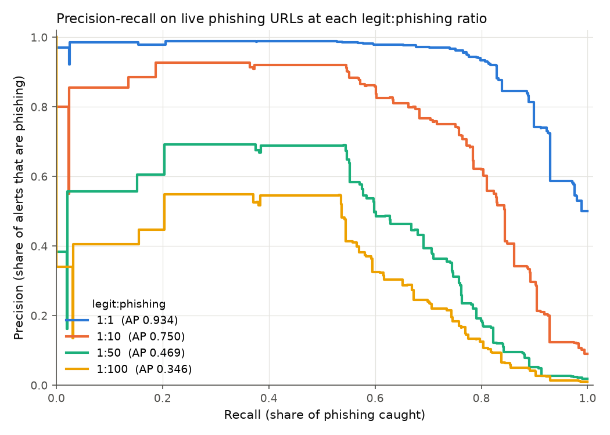
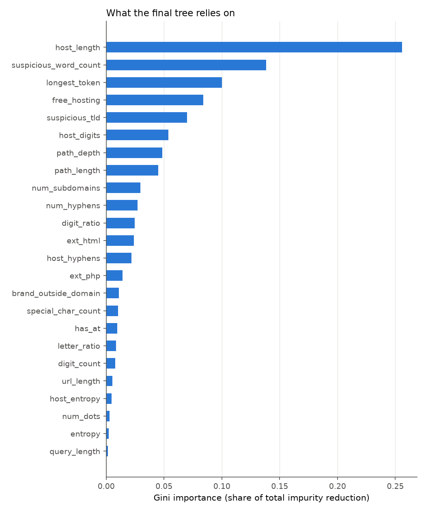
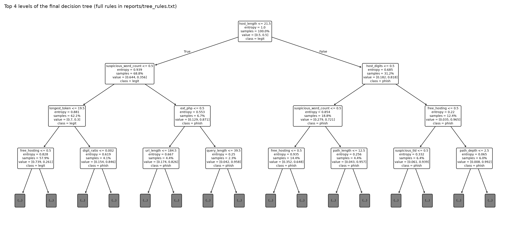

# Results (final model)

Training data: 97,844 URLs (balanced). The final model is fitted on all of it. The held-out check refits on 75,886 URLs and tests on 21,958 URLs from domains it has not seen. Live phishing test URLs: 1,398. Held-back legitimate test pool: 206,876 URLs from 145,115 domains.

## Final tree

Settings chosen by grouped cross-validation with pruning: {'ccp_alpha': 0.0003, 'criterion': 'entropy', 'min_samples_leaf': 20} (CV average precision 0.9382). Depth 18, 148 leaves. Decision threshold 0.967, chosen on validation data at 1:100. Domains in the Tranco top 10,000 are always treated as legitimate.

## Held-out domains (balanced, same sources as training)

Uses the same tuned threshold, which is set for 1:100. On balanced data that threshold is very strict, so recall here is low and precision high.

| precision | recall | f1 | avg_precision | accuracy | tp | fp | fn | tn |
|---|---|---|---|---|---|---|---|---|
| 0.9836 | 0.4676 | 0.6339 | 0.9518 | 0.7042 | 5,622 | 94 | 6,401 | 9,841 |

## Live phishing URLs at realistic imbalance

Mean ± standard deviation over 10 draws. Each draw takes a fresh random sample of legitimate URLs and a bootstrap resample of the phishing URLs. Accuracy is shown only for contrast: at 1:100 a model that flags nothing already scores 0.990.

| ratio | precision | recall | f1 | avg_precision | accuracy | false_positives | phishing_caught |
|---|---|---|---|---|---|---|---|
| 1:1 | 0.985 ± 0.004 | 0.578 ± 0.016 | 0.728 ± 0.013 | 0.934 ± 0.007 | 0.784 ± 0.008 | 13 | 808 |
| 1:10 | 0.864 ± 0.009 | 0.571 ± 0.011 | 0.687 ± 0.009 | 0.739 ± 0.008 | 0.953 ± 0.001 | 126 | 798 |
| 1:50 | 0.565 ± 0.012 | 0.575 ± 0.013 | 0.570 ± 0.011 | 0.470 ± 0.017 | 0.983 ± 0.000 | 618 | 804 |
| 1:100 | 0.396 ± 0.008 | 0.572 ± 0.011 | 0.468 ± 0.009 | 0.339 ± 0.009 | 0.987 ± 0.000 | 1,219 | 800 |

## Live test by source

| set | source | urls | flagged_as_phishing |
|---|---|---|---|
| live phishing | openphish | 531 | 0.4920 |
| live phishing | openphish\|phishunt | 38 | 0.6580 |
| live phishing | phishunt | 829 | 0.6240 |
| held-back legitimate | commoncrawl | 19,170 | 0.0070 |
| held-back legitimate | commoncrawl\|tranco | 2 | 0.0000 |
| held-back legitimate | kaggle_benign | 59,325 | 0.0240 |
| held-back legitimate | kaggle_benign\|tranco | 322 | 0.0000 |
| held-back legitimate | tranco | 128,057 | 0.0020 |

## Robustness check: host-only features

Same data, pruning, threshold rule and allowlist, but only features of the host name: host_length, host_hyphens, host_digits, host_entropy, num_subdomains, ip_host, is_shortener, has_punycode, has_port, suspicious_tld, free_hosting. Settings {'ccp_alpha': 0.0001, 'criterion': 'entropy', 'min_samples_leaf': 100}, threshold 0.954.

| precision | recall | f1 | avg_precision | accuracy | tp | fp | fn | tn |
|---|---|---|---|---|---|---|---|---|
| 0.9936 | 0.4033 | 0.5737 | 0.9043 | 0.6719 | 4,849 | 31 | 7,174 | 9,904 |

| ratio | precision | recall | f1 | avg_precision | accuracy | false_positives | phishing_caught |
|---|---|---|---|---|---|---|---|
| 1:1 | 0.991 ± 0.005 | 0.297 ± 0.017 | 0.457 ± 0.020 | 0.917 ± 0.007 | 0.647 ± 0.009 | 4 | 415 |
| 1:10 | 0.905 ± 0.013 | 0.298 ± 0.011 | 0.449 ± 0.013 | 0.692 ± 0.007 | 0.933 ± 0.001 | 44 | 417 |
| 1:50 | 0.656 ± 0.016 | 0.297 ± 0.011 | 0.409 ± 0.012 | 0.472 ± 0.011 | 0.983 ± 0.000 | 218 | 416 |
| 1:100 | 0.485 ± 0.014 | 0.290 ± 0.015 | 0.363 ± 0.015 | 0.369 ± 0.012 | 0.990 ± 0.000 | 429 | 405 |

The gap between this and the full model is how much the path and query contribute.
